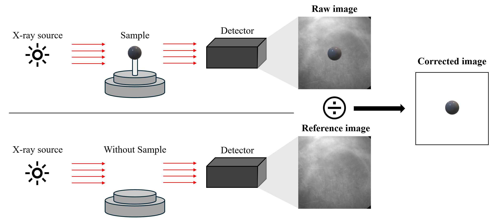
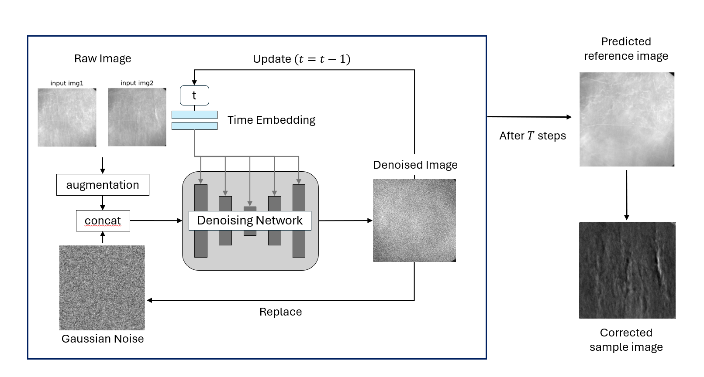

## Nano-CT Background Correction on Diffusion model

使用DDPM去除TXM拍攝影像的背景  

Diffusion model (DDPM) for background correction of TXM images.  
(based on [SR3 - Super Resolution with Diffusion Probabilistic Model](https://github.com/novwaul/SR3))

## Overview  

In TXM, each pixel of the detector may respond differently to incoming X-rays due to variations in sensitivity and illumination. These discrepancies can lead to image artifacts, such as shading or uneven brightness, which can obscure important details in the sample being imaged. Traditionally, we'll get a reference image from empty space, and use it to remove the background of the raw sample image. However, the reference image will change by time due to the instablity of the light source, which means the reference image should be take as frequently as possible. Because of the limitation of the TXM equipment, we can't get a reference during the imaging process of a mosaic or a tomography. Therefore, we develop a background correction model based on DDPM to achieve high quality TXM images postprocessing without actual reference image.  



### Model Architecture 

A pair of TXM images acquired within a short time interval should have the same background. Based on this assumption, we use a diffusion model to extract common features from the image pair and generate a possible background image.



## Installation  

This model is implemented on `python 3.11` with `torch 2.3.1` 

1. Clone the repository:
   ```bash
   git clone https://github.com/JieChungChen/NanoCT_background_correction_on_DDPM.git
   cd NanoCT_background_correction_on_DDPM
   ```

2. Install torch 2.3.1 or above according to your CUDA version from [pytorch.org](https://pytorch.org/get-started/locally/)
    ```
    pip install torch==2.3.1 torchvision==0.18.1 --index-url https://download.pytorch.org/whl/cu121
    ```

3. Install other dependencies  
    ```
    pip install -r requirements.txt
    ```

## Quick Start  

### Inference

Download the pre-trained model [here (dropbox)](https://www.dropbox.com/scl/fo/ctko74fgzwyy3de2kk1u2/AM5oMW5wIejuuSTKW3jLjd8?rlkey=kkszxmw0zoi3e8xz4c9ccpdgz&st=tu9xwpxt&dl=0).

You can use [demo.ipynb](demo.ipynb) to remove the background from the images in [demo_imgs](demo_imgs) as example. 

or  
```
python inference.py --test_img_dir FOLDER_PATH_OF_YOUR_IMGS
```

### Training

#### From scratch

If you want to train the model from scratch, please prepare the sample image and reference image folders respectively, and change the path settings in `ddpm_pair_v3.yml` accordingly.

若要從頭開始訓練模型，請分別準備好 sample image 和 reference image 資料夾，並更改`ddpm_pair_v3.yml`裡的路徑設定。

```
data_settings:
  train_sample_data: training_data/sample 
  train_ref_data: training_data/TXM_2025_reference
```

single gpu command
```
python main.py --config configs/ddpm_pair_v3.yml
```

multi-gpu command (with 4 gpus) 
```
torchrun --standalone --nproc_per_node=4 main.py --config configs/ddpm_pair_v3.yml
```

#### Fine-tuning

If you want to fine-tune the model, please also prepare the sample image and reference image folders respectively, and download the pre-trained model to `checkpoints` folder, and change the pretrained model path settings in `ddpm_pair_finetune.yml` accordingly.

若要進行模型微調，同樣請準備好 sample 和 reference image 資料夾，並下載預訓練模型至`checkpoints`資料夾、更改`ddpm_pair_finetune.yml`裡的pretrained模型路徑設定。

```
data_settings:
  pretrained_weight: checkpoints/ddpm_pair_v3_400K.pt
```
single gpu command
```
python main.py --config configs/ddpm_pair_finetune.yml
```

multi-gpu command (with 4 gpus) 
```
torchrun --standalone --nproc_per_node=4 main.py --config configs/ddpm_pair_finetune.yml
```

## Results

* **DDPM_PAIR_BASE** (testing set)  
  


* **DDPM_PAIR_V2** (testing set)  


