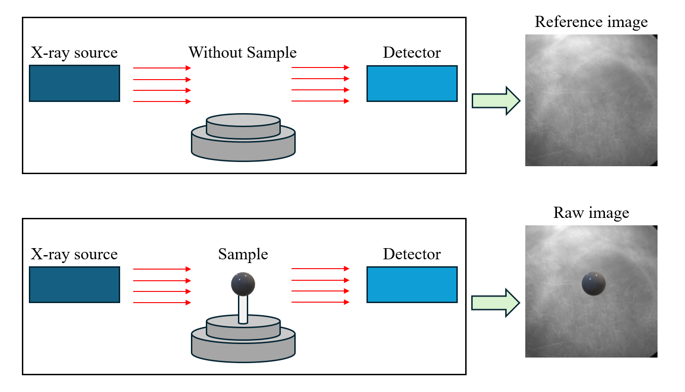
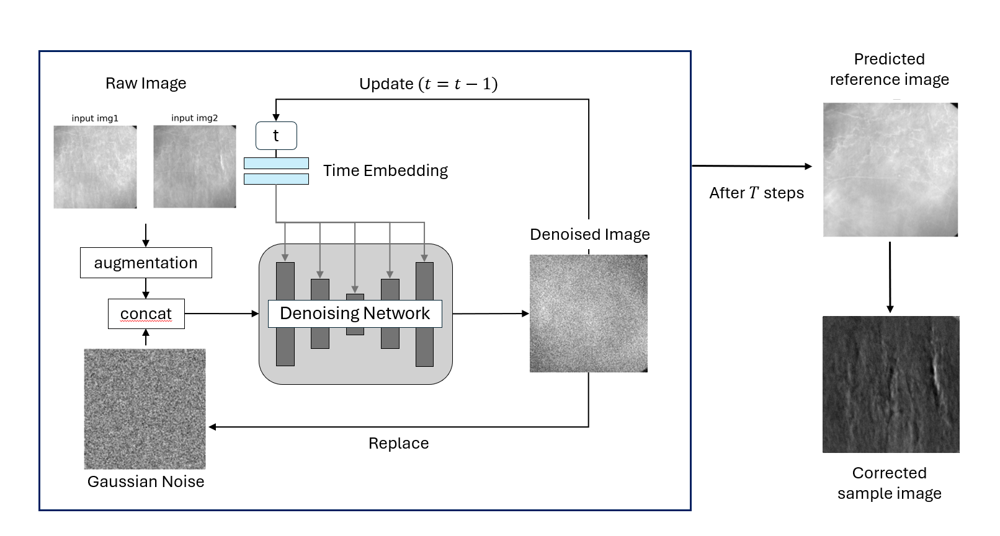
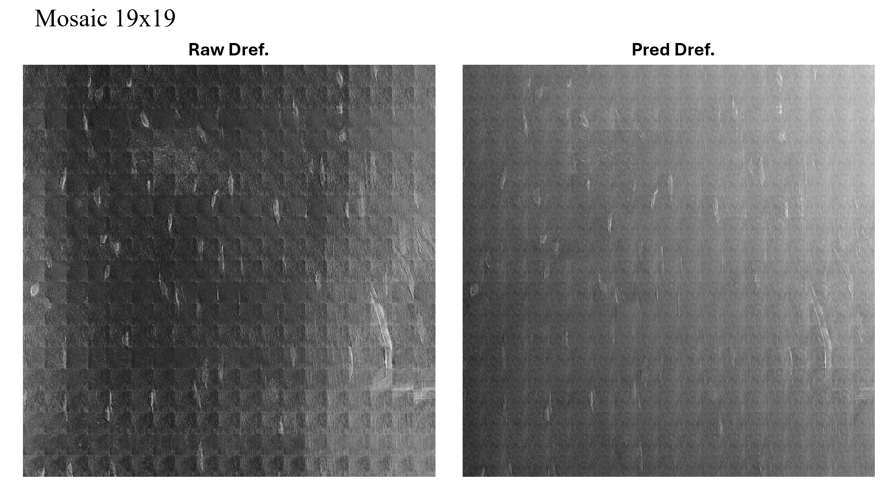

## Nano-CT Background Correction on DDPM

### introduction

In TXM, each pixel of the detector may respond differently to incoming X-rays due to variations in sensitivity and illumination. These discrepancies can lead to image artifacts, such as shading or uneven brightness, which can obscure important details in the sample being imaged.

### model architecture 

### training

* multi-gpu command  
  `torchrun --standalone --nproc_per_node=4 main.py`

### Results

